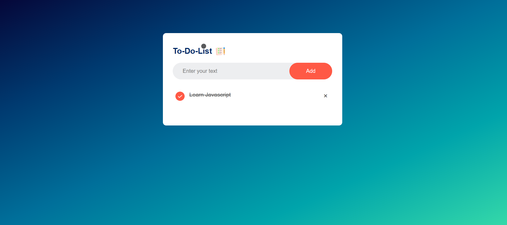

# To-Do List App

A simple To-Do List web application built with HTML, CSS, and JavaScript. It allows users to add tasks, mark them as completed, and remove them. The app's data is saved in the local storage, so tasks persist even after a page refresh.

## Features

- **Add Task**: Enter text into the input field and click the "Add" button to create a new to-do item.
- **Mark as Completed**: Click on a task to mark it as completed (crossed out).
- **Remove Task**: Click the "×" button next to a task to delete it.
- **Persistent Data**: Tasks are saved to the browser's local storage, so they remain even after a page reload.

## Technologies Used

- **HTML**: Structure of the application.
- **CSS**: Styling and layout of the app, with responsive design for different screen sizes.
- **JavaScript**: Interactivity, including adding, completing, and removing tasks, as well as saving data in local storage.

## Screenshots

## Live Demo
Check out the live version [here](https://abins2003.github.io/To-do-list/).

